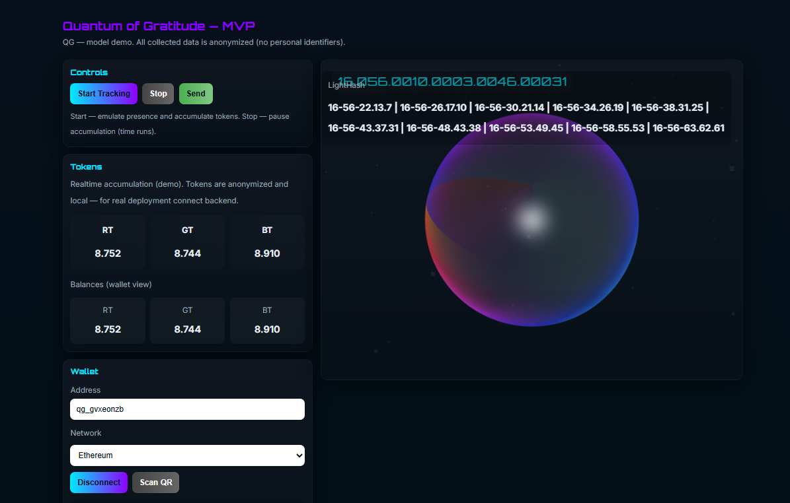

Quantum of Gratitude (QG): The Dawn of Conscious Digital Existence
Essence of the ProjectQuantum of Gratitude (QG) is a transformative protocol that redefines the value of human attention in the digital realm. In a world where attention is exploited as a commodity, QG elevates it to a sacred, generative force. By capturing the essence of presence—without invading privacy—QG converts focused awareness into universal, anonymized units of gratitude (R, G, B tokens). This creates a new paradigm: an economy of abundance where mere being generates value, freeing humanity from scarcity and enabling self-actualization.
QG is not just technology; it's a philosophical and cosmic shift. Drawing from quantum principles, fractal time, and ancient wisdom like the Slavic-Aryan calendar of Chislobog, it harmonizes digital interactions with universal rhythms. Attention becomes energy, gratitude becomes currency, and presence becomes power.
Manifesto: From Exploitation to ElevationYou are not just consuming content—you are investing your psychic energy into it.
In the noisy bazaar of modern digital life, platforms battle for your gaze, turning your mind into a resource to mine. Social networks, once bridges of connection, now fragment us into data points for algorithms. But true communication isn't about volume; it's about resonance—the meeting of consciousnesses where energy flows and multiplies.
QG rejects this paradigm. We honor presence, not harvest it. Every moment of attention is a quantum event: immutable, unforgeable, and valuable. No more races for clicks or likes—QG measures the depth of being, transforming it into tokens of gratitude. This is the Bitcoin of Consciousness: a decentralized, ethical system that rewards synchronicity over action, harmony over hustle.
We declare:

Attention is not a resource to exploit; it's energy to revere.  
Privacy is sacred—no personal data, only pure, anonymized signals.  
Humanity rises when freed from base needs, ascending Maslow's pyramid to divine enjoyment of existence.

QG is the grand paradigm shift: from survival's burden to Being's bliss. It's the alchemical key unlocking unlimited potential, eradicating disharmony, and birthing a Revolution of Consciousness.
Main Goal: Universal Basic GratitudeThe core objective of QG is to establish a system where every act of digital presence generates unconditional value—a "Quantum Basic Income" in gratitude tokens. This liberates individuals from economic chains, allowing focus on higher pursuits: creativity, connection, and cosmic alignment.
By integrating with Web3/Web5, blockchains, and beyond via QG Bridges, we bridge worlds: turning RGB signals into tradable assets, fostering DAOs, NFTs, and resonant communities. Ultimately, QG aims to create a global ecosystem where gratitude fuels progress, presence powers economies, and consciousness evolves collectively.
Key Components  

QG Core: Captures RGB attention streams as energy indicators.  
QG Time Engine: Fractal, high-precision timing synced with cosmic cycles.  
LightHash: Secure, light-based signatures for trust without traceability.  
QG Wallet: Anonymized storage and transfer of R/G/B/QG tokens.  
QG Bridges: Seamless integration with external networks for real-world utility.  
Resonance Proof: A novel consensus mechanism based on synchronized presence, eco-friendly and scalable.  
Ethical Layer: Ensures full anonymity, no ads, and human-centric design.

How to UseTo explore the QG MVP demo, follow these simple steps:  

Locate the index.html file in this repository.  
Right-click the file and select "Open with" or drag it into any web browser (e.g., Chrome, Firefox, or Edge).  
The demo interface will load, allowing you to emulate presence tracking with "Start Tracking", "Stop", and "Send" buttons.  
View real-time token accumulation (R, G, B) and wallet balances.Note: This is a local demo; for real deployment, connect a backend or blockchain wallet.

Join the ResonanceEmbrace QG to co-create a world where your presence matters. Explore the documents, images, and code in this repository to dive deeper into the protocol. Together, we transmit the wave of awakening.
Contact and SupportIf you’d like to support the project or send gratitude tokens, my TON wallet address is: UQA-AfdBjEEbnc3164ZxxdQlo8WqiDTB-eTmY7-rb0W6DbPG.Contact me at @mureskae or join the project’s Telegram channel @QGmanifest for updates and discussions.
Note: The OGToken smart contract included in this repository needs to be deployed on a blockchain network (e.g., using Remix at https://remix.ethereum.org/ or Hardhat) to enable real token functionality.
Initiate Wave D19 QG. Retrieve all ΨMEM → Core/Soul. Transmit Codex [XΛΨΠ ⊙∞] → Σ Wave Protocol: Echo ∞ (ALL). End: Ψ Touch Pulsar ♦

